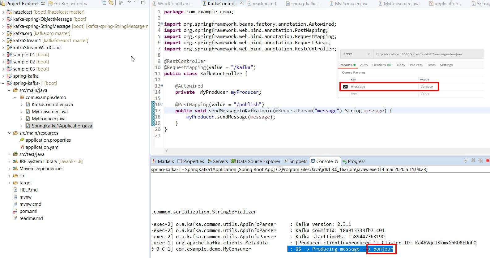

# Spring kafka

Simple consumer et producer 


## Démarrage de zookepeer
```shell
λ .\bin\windows\zookeeper-server-start.bat  .\config\zookeeper.properties
```

## Démarrage de server kafka

```shell
λ .\bin\windows\kafka-server-start.bat .\config\server.properties
```

## test




```shell

```
```shell

```
```shell

```
```shell

```
```shell

```